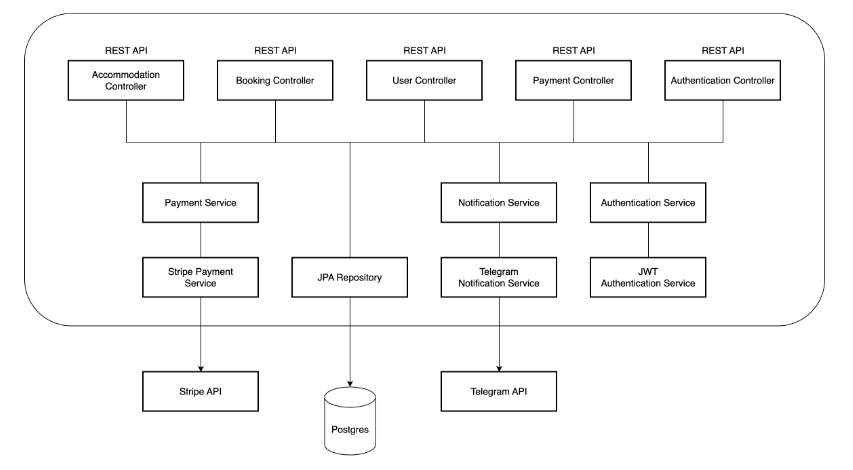
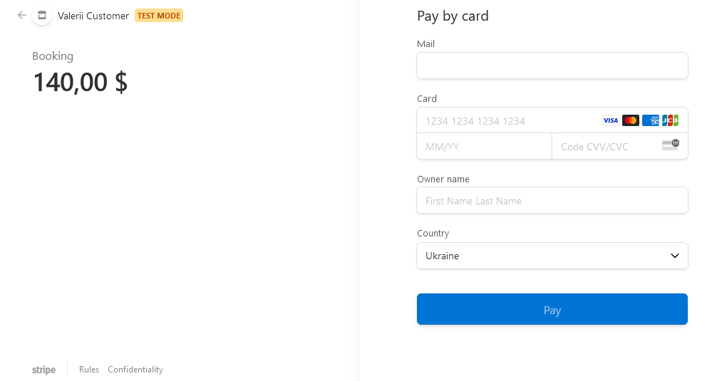
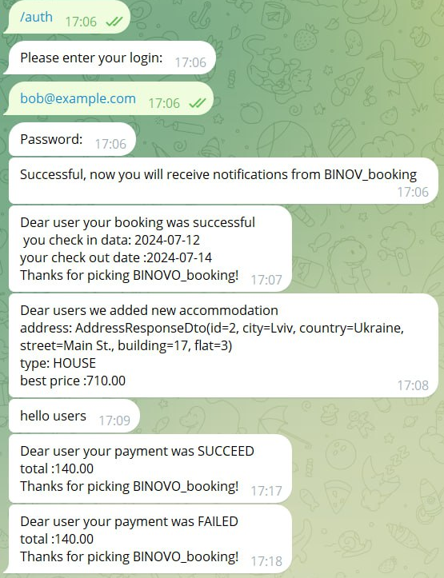
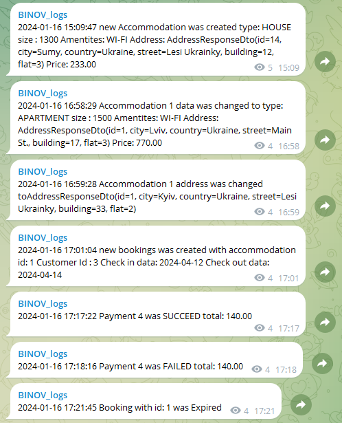

# 
BINOV BOOKING

Embark on a housing revolution with our BINOV Booking! 🌟 Our goal? Streamline property management, empower customers, and redefine how you experience housing rentals.

Picture this: Effortless booking, real-time property availability checks, and a seamless interface for both customers and managers. Add, view, and modify accommodations with ease. The best part? Secure, cashless transactions through Stripe, making payments a breeze. 💳💨

But wait, there's more! Stay in the loop with our Telegram Notifications Service. Get instant updates on bookings, cancellations, and successful payments. Say goodbye to the old and welcome the future of hassle-free, modern housing rentals! 🚀🏠

P.S. You can easily read the documentation and test our project [HERE](http://ec2-54-174-166-23.compute-1.amazonaws.com/api/swagger-ui/index.html).😉

### 
We used such technologies and tools:

  
<b>Spring Boot</b>

*A framework for building and deploying Java applications with an embedded server, simplifying configuration and accelerating development.*

  
<b>Spring Data JPA</b>

*Part of the Spring Data project, providing an abstraction for working with databases through JPA (Java Persistence API), simplifying interaction with relational databases.*

  
<b>Spring MVC</b>

*Model-View-Controller framework for developing web applications, enabling easy creation of websites and web services.*

  
<b>Spring Security</b>

*Framework for securing Spring applications, adding authentication and authorization to protect resources.*

  
<b>AWS (Amazon Web Services)</b>

*A comprehensive and widely-used cloud computing platform offering a variety of services such as computing power, storage, databases, machine learning, and more.*

  
<b>Docker</b>

*Platform for automating deployment and managing containerized applications, simplifying work with isolated environments.*

  
<b>JUnit</b>

*A popular testing framework for Java that provides annotations to identify test methods, assertions for testing expected results, and test runners for executing test cases.*

  
<b>Liquibase</b>

*Tool for version control of database schemas, allowing controlled schema changes.*

  
<b>Lombok</b>

*Library that automates code generation to reduce boilerplate cLombok: ode, such as getters, setters, and equals/hashCode.Lombok: ode, such as getters, setters, and equals/hashCode.*

  
<b>Mapstruct </b>

*Library for automatic code generation of mappings between Java objects, simplifying conversion between different models.*

  
<b>Maven</b>

*Tool for managing project dependencies, compilation, building, and publishing of Java programs.*

  
<b>Mockito</b>

*A mocking framework for Java that allows the creation of mock objects in automated tests, facilitating the isolation of code units for more effective testing.*

  
<b>PostgreSQL </b>

*Relational database that uses the SQL language for managing and interacting with data.*

  
<b>Stripe API</b>

*A set of tools and APIs for building online payment solutions, allowing developers to integrate payment processing into their applications.*

  
<b>Swagger</b>

*Tool for automatically generating API documentation, allowing developers to interactively engage with and understand the structure of the API.*

  
<b>Telegram API</b>

*A set of APIs provided by Telegram Messenger for building chatbots, integrations, and other applications on the Telegram platform.*

### 
Project structure:

### 
The project has such controllers:

📝🔑**Authentication Controller** - endpoints with open access for new users who want to register and for registered users who want to log in.

| HTTP method |       Endpoint        |           Description           |
|:-----------:|:---------------------:|:-------------------------------:|
|    POST     | `/auth/registration ` |    Register a new customer.     |
|    POST     |    `/auth/login `     | Login as a registered customer. |

🧑‍💼 **Customer Controller** - endpoints for managing customers.

| HTTP method |         Endpoint         |   Role   |                               Description                                |
|:-----------:|:------------------------:|:--------:|:------------------------------------------------------------------------:|
|     PUT     | `/customers/{id}/role" ` | MANAGER  | Enables managers to update customers roles, providing role-based access. |
|     GET     |     `/customers/me`      | CUSTOMER | Retrieves the profile information for the currently logged-in customer.  |
|     PUT     |     `/customers/me`      | CUSTOMER |          Allows customers to update their profile information.           |

🏠 **Accommodation Controller** - endpoints for managing accommodations.

| HTTP method |            Endpoint            |   Role   |                          Description                           |
|:-----------:|:------------------------------:|:--------:|:--------------------------------------------------------------:|
|    POST     |       `/accommodations `       | MANAGER  |          Permits the addition of new accommodations.           |
|     GET     |       `/accommodations`        | CUSTOMER |          Provides a list of available accommodations.          |
|     GET     |     `/accommodations/{id}`     | CUSTOMER | Retrieves detailed information about a specific accommodation. |
|     PUT     |     `/accommodations/{id}`     | MANAGER  |            Allows updates to accommodation details.            |
|     PUT     | `/accommodations/{id}/address` | MANAGER  |            Allows updates to accommodation address.            |
|   DELETE    |     `/accommodations/{id}`     | MANAGER  |             Enables the removal of accommodations.             |

🗓️ **Booking Controller** - endpoints for managing bookings.

| HTTP method |        Endpoint         |   Role   |                        Description                        |
|:-----------:|:-----------------------:|:--------:|:---------------------------------------------------------:|
|    PATCH    | `/bookings/{id}/status` | MANAGER  |         Allows manager to change booking status.          |
|    POST     |       `/bookings`       | CUSTOMER |    Permits the creation of new accommodation bookings.    |
|     GET     |     `/bookings/my`      | CUSTOMER |               Retrieves customer bookings.                |
|     GET     |    `/bookings/{id}`     | CUSTOMER |      Provides information about a specific booking.       |
|     PUT     |    `/bookings/{id}`     | CUSTOMER |     Allows customers to update their booking details.     |
|   DELETE    |    `/bookings/{id}`     | CUSTOMER |           Enables the cancellation of bookings.           |
|     GET     |   `/bookings//search`   | MANAGER  | Retrieves bookings based on customer ID and their status. |

💳 **Payment Controller (Stripe)** - endpoints for managing payments.

| HTTP method |      Endpoint       |  Role   |                       Description                       |
|:-----------:|:-------------------:|:-------:|:-------------------------------------------------------:|
|     GET     |     `/payments`     |   ALL   |        Get payments history of certain customer.        |
|    POST     |     `/payments`     | MANAGER |          Checkout payment for user's booking.           |
|     GET     | `/payments/success` |    -    |  Redirection after successfully processing of payment.  |
|     GET     | `/payments/cancel`  |    -    | Redirection after unsuccessfully processing of payment. |

### 
Notifications Service (Telegram):

Receive instant updates on:

- 📅 New bookings 
- 🏡 Newly created/released accommodations
- 💳 Successful payments

Our Notifications Service acts as the central hub, allowing seamless interactions with other services to keep administrators in the loop. 🔄

Key Features:

- 🤖 Utilizes Telegram API for secure notifications
- 💬 Engage through Telegram Chats
- 🚀 Enhance efficiency with purpose-built Telegram Bots

Stay in control and informed with our Telegram Notifications Service! 🌟

 

### 
 Challenges and Solutions:

1. ❌**Payment Session Creation**

   _Challenge:_ We encountered difficulties in creating payment sessions, but through diligent research and exploration of the Stripe documentation, we successfully resolved these issues. Understanding the intricacies of payment session creation proved crucial to ensuring a seamless payment process.

2.  🚨**Console Error Overload**

   _Challenge:_ Our console was flooded with errors, mainly stemming from the fact that a single token was used by everyone. This issue was hampering the user experience and platform functionality. 

   _Solution:_ To overcome this challenge, we implemented a solution by creating a new bot for each user. This not only addressed the error overload but also improved the security and individualized the interactions for each user, ensuring a more stable and reliable system.

### 
 Possible Improvements:

- 🌟 **User Reviews and Ratings:** Implement a feature for users to leave reviews and ratings for accommodations. This can enhance the decision-making process for other users and provide valuable feedback for property owners.

- 🔍 **Advanced Search Filters:** Enhance the search functionality with advanced filters such as price range, specific amenities, and accommodation types. This will provide users with more precise search results based on their preferences.

### 
You can test and use this project:

1. 🚀 Install [Docker](https://www.docker.com/products/docker-desktop/)
2. 📦 Clone [THIS](https://github.com/jv-sep23-binov/accommodation-booking-service) repository
3. 🔧 Configure a "**.env**" file with necessary environment variables
4. 🛠️ Run the command `mvn clean package`
5. 🚢 Use `docker-compose up --build` to build and launch Docker containers
6. 🌐 Access the locally running application at http://localhost:8088
### 
OR 

1. You can easily read the documentation and test our project [HERE](http://ec2-54-174-166-23.compute-1.amazonaws.com/api/swagger-ui/index.html).

### 
Authors:

- 👨‍💻[Valerii Fedorovych](https://github.com/fedorovychh)
- 👨‍💻[Igor Korolevich](https://github.com/DevIgork)
- 👨‍💻[Bohdan Bilko](https://github.com/BohdanTrue)
- 👨‍💻[Alexander Liubchenko](https://github.com/Alexander1iubchenko)
- 👩‍💻[Nataliia Shtykh](https://github.com/nshtykh)

